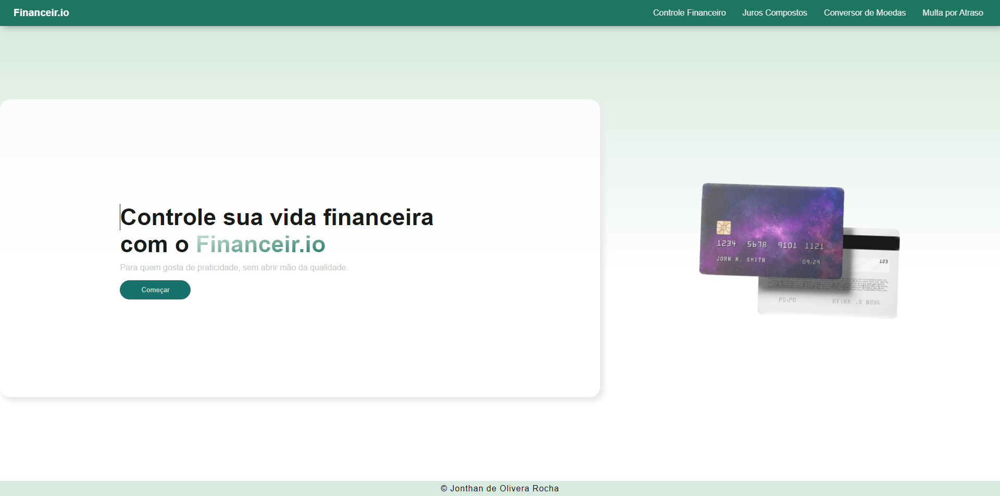
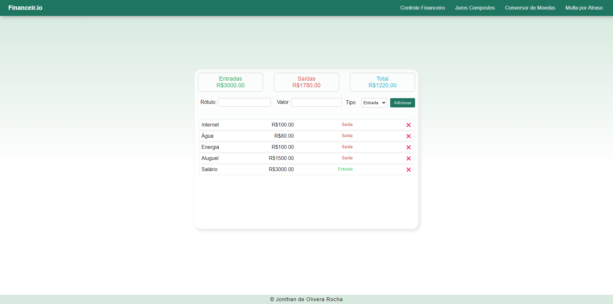
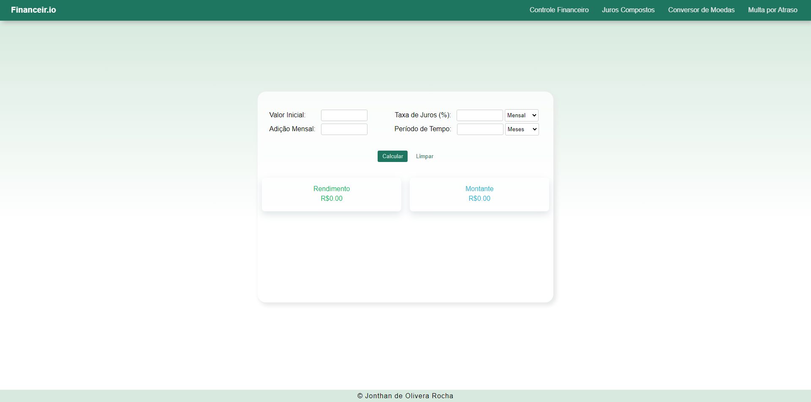
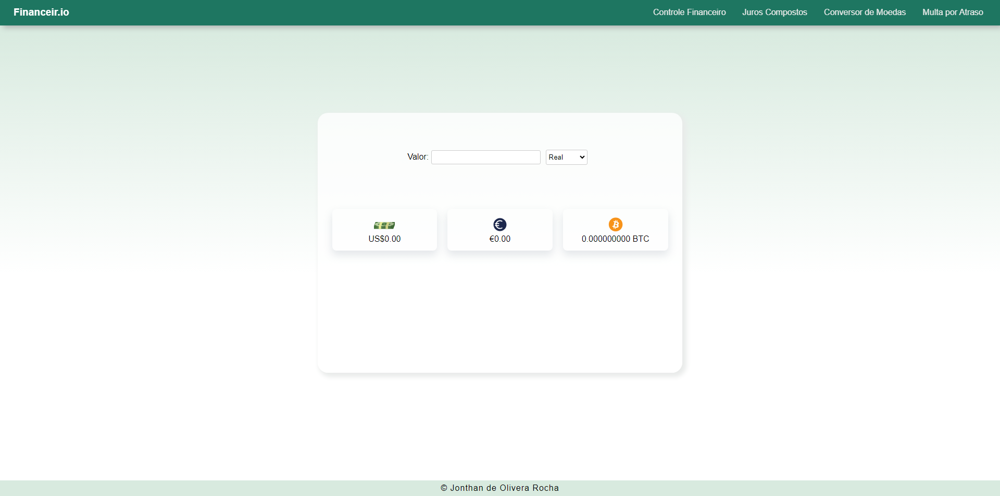
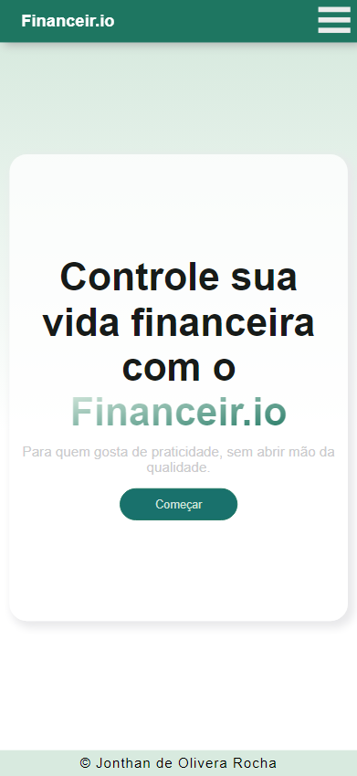
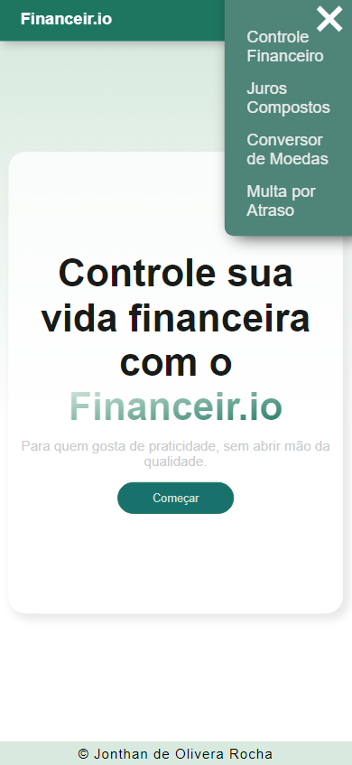
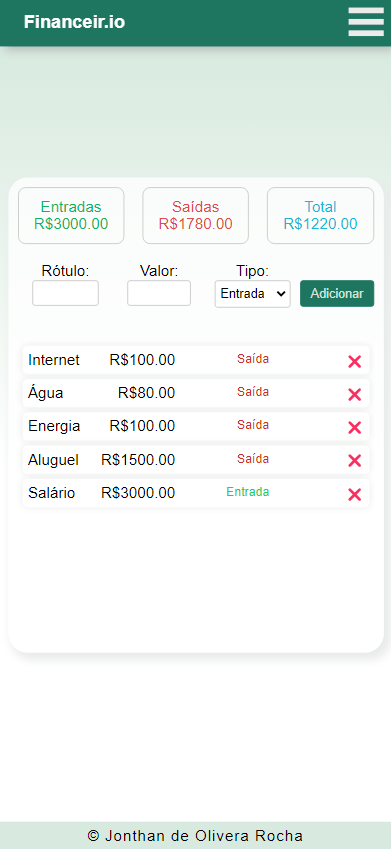
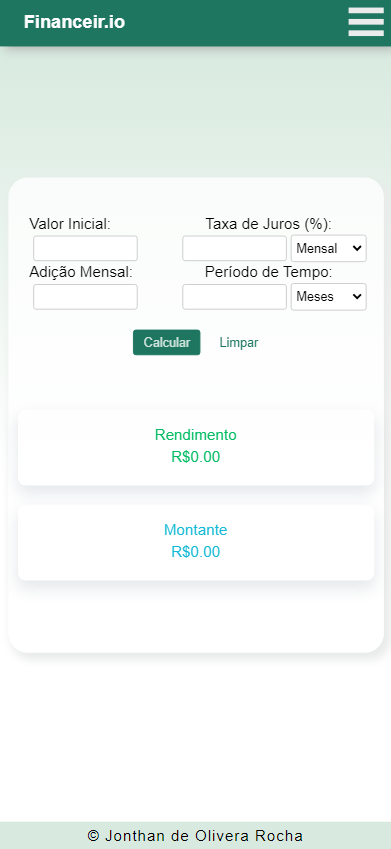
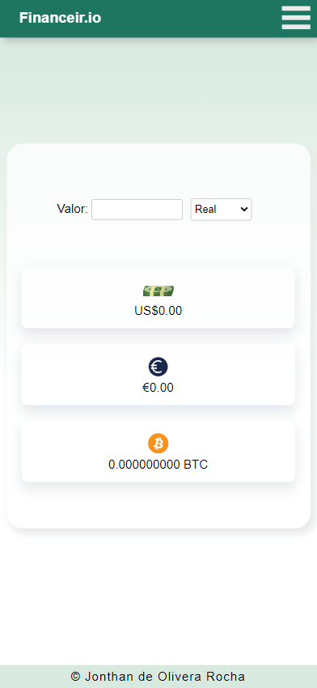
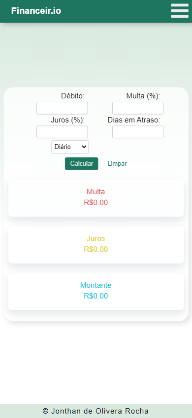

# Financeir.io

**Accessible project link: <a href="https://financeir-io.vercel.app/">Financeir.io</a>**

## Summary

1. [What it is](#what-it-is)
2. [Running the application locally](#running-the-application-locally)
3. [Preview](#preview)

## What it is

The application is a financial manager, with the idea of ​​helping users take better care of their money. The program has a part for cash control, with information saved on local storage, a section for calculating return on investment, another for currency conversion, and even a calculator for overdue debts. Application with a minimalist and pleasant design, as well as completely responsive.

> Program developed in my native language (Portuguese).

### Technologies and libraries used :

- HTML, CSS , JavaScript
- React
- styled-components

## Running the application locally

1. First, make sure you have <a href="https://nodejs.org/en">Node.js</a> installed on your machine.

2. Then run the “start.bat” file in the root directory.

## Preview

#### Desktop

<table width="100%">
<td width="100%">

</td> 
</table>

<table width="100%"> 
<tr>
<td width="50%">

</td> 
<td width="50%">

</td> 
</tr>
<tr>
<td width="50%">

</td> 
<td width="50%">

</td> 
</tr>
</table>

#### Mobile

<table width="100%"> 
<td width="25%">

</td> 
<td width="25%">

</td> 
<td width="25%">

</td> 
<td width="25%">

</td> 
</table>

<table width="100%"> 
<td width="50%">

</td> 
<td width="50%">

</td> 
</table>
