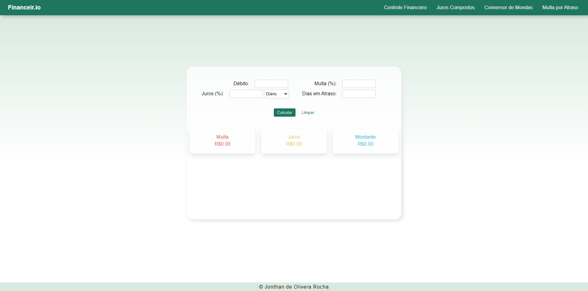

## Financeir.io

**Accessible project link: <a href="https://financeir-io.onrender.com/">Financeir.io</a>**

### What it is :

The application is a financial manager, with the idea of ​​helping users take better care of their money. The program has a part for cash control, with information saved on local storage, a section for calculating return on investment, another for currency conversion, and even a calculator for overdue debts. Application with a minimalist and pleasant design, as well as completely responsive.

> Program developed in my native language (Portuguese).

### Technologies and libraries used :

- HTML, CSS , JavaScript
- React

> The code was completely commented, for easy understanding of how the entire program works. Furthermore, it is responsive to different screen sizes, making it possible to easily view it on different devices.

### Running the Application :

1. First, make sure you have <a href="https://nodejs.org/en">Node.js</a> installed on your machine.

2. Then install the project <a href="./package.json">requirements</a> with the command in the terminal:

   ```bash
   npm install

   ```

3. Now just open the local server with the command: :

   ```bash
   npm run dev

   ```

### Preview :

#### Desktop

<table width="100%">
<tr>
<td width="100%">

</td> 
</table>

<table width="100%"> 
<tr>
<td width="50%">

</td> 
<td width="50%">

</td> 
<tr>
<td width="50%">

</td> 
<td width="50%">

</td> 
</table>

#### Mobile

<table width="100%"> 
<tr>
<td width="25%">

</td> 
<td width="25%">

</td> 
<td width="25%">

</td> 
<td width="25%">

</td> 
</table>

<table width="100%"> 
<tr>
<td width="50%">

</td> 
<td width="50%">

</td> 
</table>
